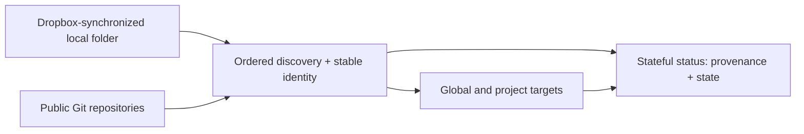

# Why skill-manager: flexible sources and stateful inventory

`skill-manager` exists for the part of skill management that begins after a
one-time copy: keeping instructions discoverable, attributable, and safe to
deploy as sources and destinations change. A source may be a local directory
or a GitHub repository, and the useful content may be one skill or a collection
of skills. The manager gives those inputs stable identities and a durable view
of what is available and what is deployed.

## Sources are ordered, identifiable inputs

Sources can point at local files or GitHub. A GitHub source can select a
repository subpath, and either kind can be configured as a collection (skill
directories immediately below the source root) or as a single skill (the source
root itself). A source can also retain an inactive alternate location: for
example, a local checkout paired with a GitHub location. Swapping the active
and inactive locations changes where discovery reads without changing the
source's identity.

Source order is part of the configuration. Discovery uses first-source-wins for
duplicate skill names, with the name comparison folded consistently. This
keeps a deliberate precedence rule instead of making the result depend on
filesystem enumeration or network timing. Collisions remain inspectable: a
qualified `describe SOURCE:SKILL` can show the shadowed physical copy, and
`resolve` can persist an exclusion when the losing source should stay out of
future discovery. The result is both predictable and explainable.

> Design rationale: source identity, order, and alternates are durable data
> because “which instructions did I deploy?” is a question that should have
> the same answer after the next refresh, machine restart, or source move.

## Targets and scope make deployment explicit

The same discovered skill can be deployed to one or more targets, such as
`claude`, `shared`, or `antigravity`. Each target has a global location under
the manager home and a project location under the exact current working
directory. Project deployments take precedence over global deployments for the
effective skill, while status retains both copies so a global copy that is
shadowed by a different project copy is not hidden.

This lets a shared baseline coexist with a project-specific variation without
requiring a separate source for every project. The target and scope chosen for
a load or update are rendered in the plan, so a user can review the intended
blast radius before anything is written.

## An inventory, not just a copy operation

The manager maintains an inventory that connects each discovered skill to its
source and each deployment to its target and scope. Status compares relative
regular-file names and SHA-256 content, then reports one of four states for an
effective source/target pair:

| State | Meaning |
| --- | --- |
| `up-to-date` | The source and deployed files match. |
| `needs-update` | A deployment exists, but its files differ from the source. |
| `not-loaded` | The source exists, but the skill is not deployed there. |
| `no-connection` | A deployment has no corresponding source. |

The inventory also preserves useful context around those cells. Provenance
identifies the source and location; `mixed` calls out targets whose installed
copies use different non-empty scope sets; and a divergent global copy can be
marked as shadowed by the effective project copy. A shadowed source candidate
is still available to qualified `describe`, rather than disappearing from the
record. A deployed-only skill—one no longer found in configured sources—shows
`unknown` as its human source while machine output retains its deployment
provenance. These distinctions make cleanup, review, and recovery decisions
possible without guessing what happened.

## Manager-owned state and safe automation

State belongs to the manager, not to an ad hoc collection of destination
folders. By default, configuration, remote cache, immutable configuration
backups, and process/migration locks live beneath `~/.skill-manager/`. GitHub
cache metadata is tied to the stable source identity and exact remote
location, so a changed identity is not silently treated as the old content.
Deployments are staged and journaled per skill, with backups and startup
recovery for interrupted work.

`load`, `update`, `copy`, and related mutating commands render a complete plan
before confirmation. `--dry-run` renders that plan and stops with no
deployment writes. For automation, `--json` emits NDJSON events; mutating
plans arrive before actions, and the structured plan carries targets, scope,
provenance, actions, and diffs. This makes a reviewable human workflow and a
machine-consumable workflow describe the same intended change.

An ordinary one-shot or single-source installer can answer “what should I
copy right now?” That can be sufficient for a simple setup, but it does not
need to remember source precedence, alternates, scoped deployments, or the
difference between an unavailable source and an outdated deployment.
`skill-manager` is for the ongoing inventory those cases require.

## How the pieces fit



In this diagram, the Dropbox item is only a local filesystem source inside a
folder synchronized or shared by Dropbox (or another file-sharing tool).
`skill-manager` has no Dropbox integration and does not perform synchronization;
it reads the folder that is available on the machine. A local source can be
temporarily absent, and remote access can fail, so status cannot guarantee
that every source is always reachable.

## A small, illustrative walkthrough

The following inventory and names are illustrative. Replace the visibly
synthetic local path with a folder that exists on your machine. In this
example, that folder is called a Dropbox-backed source only because an outside
sync tool keeps its files shared; it is still configured as a normal local
source.

```console
skill-manager source add ./Dropbox/fictional-skill-source --name fictional-dropbox --label "Fictional Dropbox skills"
skill-manager source add https://github.com/sernst/skills/tree/main/skills --name public-skills --label "Public skills"
skill-manager source list
skill-manager describe fictional-dropbox:fictional-daily-brief
skill-manager status fictional-daily-brief
skill-manager load fictional-dropbox --filter fictional-daily-brief --shared --global --dry-run
skill-manager update fictional-daily-brief --shared --global --dry-run
```

The first command uses the exact unambiguous `LOCATION --name NAME` form for a
local source; `./Dropbox/fictional-skill-source` is a fictional example, not a
real folder. The second source is a public repository and demonstrates that
local and GitHub inputs can coexist in one ordered inventory. `source list`
shows their configured order and active locations. The qualified `describe`
selector asks for provenance and the physical copy from the fictional source;
qualifying a selector also lets you inspect a shadowed copy when one exists.
`status` reports the selected skill across the configured targets and both
scopes by default.

The final two commands preview, respectively, a filtered load and an update
for the shared target at global scope. `--dry-run` renders the normal plan and
ends with `Dry run — no changes were made.`; it does not deploy either skill.
Use `--json` when a script needs the same plan and action information as NDJSON
rather than human-readable output. The example skill `fictional-daily-brief`
and source name `fictional-dropbox` are invented for this walkthrough.

For the complete command and storage contracts, see the [CLI reference](cli.md),
[configuration and migration guide](configuration.md), [JSON contract](json.md),
and [architecture note](architecture.md).
